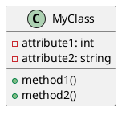

# markdown

111


## 概述

简要介绍文档的目的和内容概要。

## 目录

- [章节1](#章节1)
- [章节2](#章节2)
- [章节3](#章节3)

## 章节1

### 子标题1.1

在此处写下相关内容和笔记。

#### 代码示例：

```python
def hello_world():
    print("Hello, world!")

hello_world()
````

### 子标题1.2

在此处写下相关内容和笔记。

#### 列表示例：

- 项目1
- 项目2
- 项目3

## 章节2

### 子标题2.1

在此处写下相关内容和笔记。

#### 代码示例：

```java
public class HelloWorld {
    public static void main(String[] args) {
        System.out.println("Hello, world!");
    }
}
```

### 子标题2.2

在此处写下相关内容和笔记。

#### UML示例：





## 章节3

### 子标题3.1

在此处写下相关内容和笔记。

#### 代码示例：

```javascript
function helloWorld() {
    console.log("Hello, world!");
}

helloWorld();
```

### 子标题3.2

在此处写下相关内容和笔记。

#### 列表示例：

1. 项目1
1. 项目2
1. 项目3

## 结论

总结文档的主要观点和要点。

## 参考资料

列出用于编写文档的参考资料和来源。

```

 A: DoWork;
activate A;
A -> B: Create Request;
activate B;
B -> C: DoWork;
activate C;
C --> B: WorkDone;
destroy C;
B --> A: Request Created;
deactivate B;
A --> User: Done;
deactivate A;
@enduml
'>


当编写包含代码、列表、UML图和图片的Markdown文档笔记时，您可以使用如下模板作为起点：

````markdown
# 文档标题

## 概述

简要介绍文档的目的和内容概要。

## 目录

- [章节1](#章节1)
- [章节2](#章节2)
- [章节3](#章节3)

## 章节1

### 子标题1.1

在此处写下相关内容和笔记。

#### 代码示例：

```python
def hello_world():
    print("Hello, world!")

hello_world()
````

### 子标题1.2

在此处写下相关内容和笔记。

#### 列表示例：

- 项目1
- 项目2
- 项目3

### 子标题1.3

在此处写下相关内容和笔记。

#### UML示例：


## 章节2

### 子标题2.1

在此处写下相关内容和笔记。

#### 代码示例：

```java
public class HelloWorld {
    public static void main(String[] args) {
        System.out.println("Hello, world!");
    }
}
```

### 子标题2.2

在此处写下相关内容和笔记。

#### 图片示例：


 A: DoWork;
activate A;
A -> B: Create Request;
activate B;
B -> C: DoWork;
activate C;
C --> B: WorkDone;
destroy C;
B --> A: Request Created;
deactivate B;
A --> User: Done;
deactivate A;
@enduml
'>

 parse [weight=8];
    parse -> execute;
    main -> init [style=dotted];
    main -> cleanup;
    execute -> { make_string; printf}
    init -> make_string;
    edge [color=red];
    main -> printf [style=bold,label="100 times"];
    make_string [label="make a string"];
    node [shape=box,style=filled,color=".7 .3 1.0"];
    execute -> compare;
  }
'>
dsd


