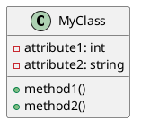

# 文档标题

## 概述

简要介绍文档的目的和内容概要。

## 目录

- [章节1](#章节1)
- [章节2](#章节2)
- [章节3](#章节3)

## 章节1

### 子标题1.1

在此处写下相关内容和笔记。

#### 代码示例：

```python
def hello_world():
    print("Hello, world!")

hello_world()
````

### 子标题1.2

在此处写下相关内容和笔记。

#### 列表示例：

- 项目1
- 项目2
- 项目3

## 章节2

### 子标题2.1

在此处写下相关内容和笔记。

#### 代码示例：

```java
public class HelloWorld {
    public static void main(String[] args) {
        System.out.println("Hello, world!");
    }
}
```

### 子标题2.2

在此处写下相关内容和笔记。

#### UML示例：





## 章节3

### 子标题3.1

在此处写下相关内容和笔记。

#### 代码示例：

```javascript
function helloWorld() {
    console.log("Hello, world!");
}

helloWorld();
```

### 子标题3.2

在此处写下相关内容和笔记。

#### 列表示例：

1. 项目1
1. 项目2
1. 项目3

## 结论

总结文档的主要观点和要点。

## 参考资料

列出用于编写文档的参考资料和来源。

```

这个模板包含了文档的基本结构，其中每个章节包含子标题、相关内容和笔记，以及相应的代码示例、列表示例和UML示例。您可以根据需要扩展和修改模板，以适应您的具体文档笔记需求。请注意，在代码示例和UML示例中使用适当的代码语法和UML语法来呈现内容。```