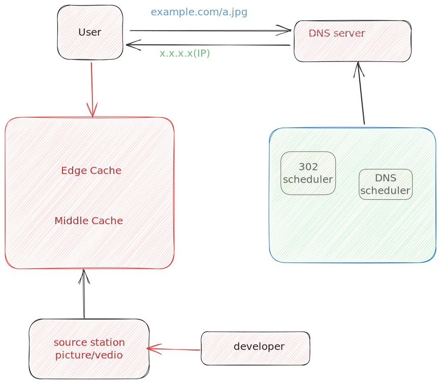

# CDN

## CDN的基本原理

就近访问资源，分布式多节点分摊源站压力

<figure><figcaption>
CDN arch
</figcaption></figure>

## CDN排障

#### 1.curl测试节点异常（例如:https://xxx.com/xx.jpg访问出问题）

从边缘节点，中间源，源站一层一层查，获得其节点IP,然后代理访问

https的话： curl https://xxx.com/xx.jpg --resolve xxx.com:443:\<ip地址>

http的话： curl http://xxx.com/xx.jpg -x \<IP地址>:80

curl -I 可以看到是否cache,这个也很关键，没有cache的话可能是回源有问题，检查回源host配置

&#x20;

## 使用CDN的成本优化

